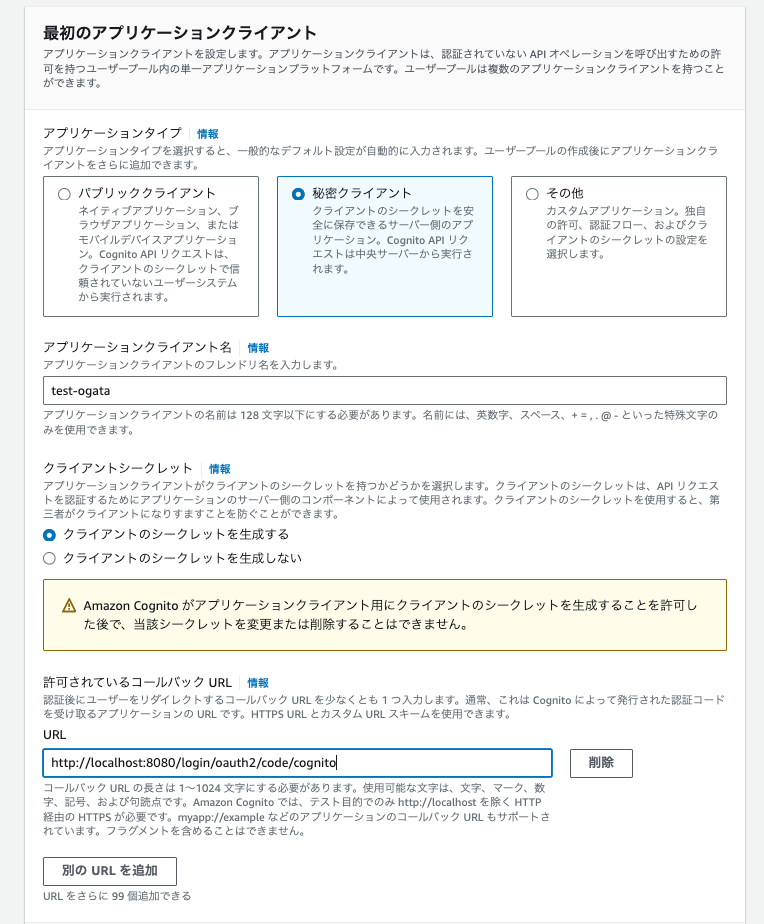

# AWS-cloudFront

<details open="open">
<summary>目次</summary>


- [今回のシステム概要図](#今回のシステム概要図)
- [作業手順](#作業手順)
- [備考](#備考)
- [参考](#参考)
</details>

# 今回のシステム概要図
<details>
<summary> システム概要図</summary>


</details>


# cognitoの設定

<details>
<summary> 1. 特に別のIdPと連携しないなら、チェックなしで次に</summary>


</details>

<details>
<summary> 2. MFA認証は入れる方がおすすめ</summary>


</details>

<details>
<summary> 3. とりあえずエラーが出るのでCognitoの方を設定</summary>


</details>

<details>
<summary> 4. アプリケーションとの統合部分（やること多い）</summary>

- ホストされた認証ページにチュックを入れて、springsecurityのauthorize-urlからアクセスできるCognitoドメインの作成
- 秘密クライエントにチェックを入れて、シークレットの生成
- コールバックURIの登録
- スコープをopenIDで設定（できるだけ少ない情報にしたかった）
- 実際に取れそうなPrincipalは下記の添付





</details>

# 作業手順

<details>
<summary> 1. cloudformation-baseをデプロイ</summary>

- リージョンの設定と、アクセスキーの情報だけ環境変数で必要
- ぶっちゃけVPC使わないので、このデプロイはなくて良い。CloudFrontはグローバルでVPCに依存しない

```zh
export AWS_DEFAULT_REGION=ap-northeast-1
```

</details>

<details>
<summary> 2. 各種環境変数を設定</summary>

- 実行ターミナルに下記の環境変数を設定

```zh
export AWS_DEFAULT_REGION=ap-northeast-1
export WAF_ACL_REGION=us-east-1
export CLOUDFRONT_REGION=ap-northeast-1
export GITHUB_ACCOUNT=hogehoge
export GITHUB_REPOSITORY=hogehoge
```

</details>

<details>
<summary> 3. IAMロールの作成</summary>

- cloudformation-iam-role.ymlをデプロイ

</details>

<details>
<summary> 4. cloudformation-wafaclをデプロイ</summary>

- wafaclをcloudformationでデプロイするにはバージニア（us-east-1）じゃないとできない。
- そのため、CloudFront作成のCloudForamationとは分けて、且つMakefile実行時にリージョンを切り替えれるように環境変数を設定する
- CLOUDFRONT_REGIONとWAF_ACL_REGIONで実行時に切り替え

</details>

<details>
<summary> 5. 環境変数に、上記のweb-aclのarnを追加してから、cloudfrontの方をデプロイ</summary>

- 下記環境変数追加
- cloudformation-cloudfrontをデプロイ

```zh
export WAF_ACL_ARN=hogehoge

make iac-cloudfront-deploy
```

</details>


# 備考

- webaclをcloudformationから作成する際はバージニアリージョンしかだめ！！！！
- - name: Deploy to S3
    run: |
    aws s3 sync frontend/build s3://あなたのバケット名 --delete
- aws s3 syncコマンドを使用して、ビルドされたファイルをS3バケットに同期します。--deleteオプションにより、S3バケット内の古いファイルが削除されます。


# 参考
